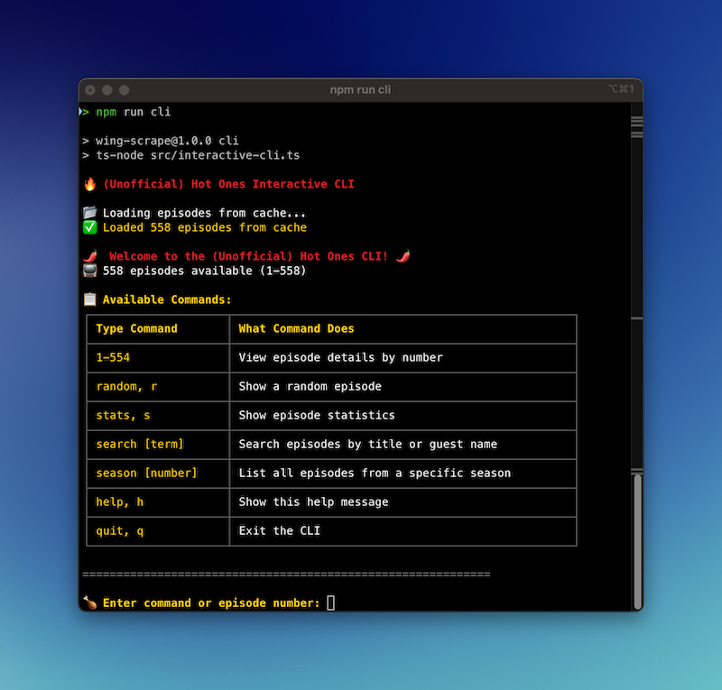

# WingScrape 🔥 🐔

A TypeScript-based web scraper and interactive CLI for analyzing Hot Ones episodes from TheTVDB. Dive into the spicy world of celebrity interviews with detailed episode data, statistics, and an engaging command-line interface.

> [!DISCLAIMER]
> This project is for educational purposes only and is not affiliated with Hot Ones, TheTVDB, or their respective owners. Created as part of the 2025 boot.dev hackathon.

## 🌶️ About Hot Ones

Hot Ones is the show with hot questions and even hotter wings! This project scrapes episode data from TheTVDB to provide insights into the popular web series where celebrities eat progressively spicier chicken wings while answering intimate questions.

## ✨ Features

- **Episode Scraping**: Automatically fetch all Hot Ones episodes from TheTVDB
- **Interactive CLI**: Browse episodes with a fun, emoji-rich command-line interface
- **Episode Search**: Find episodes by guest name or title
- **Statistics**: Get insights into episode data and show trends
- **Random Discovery**: Discover random episodes to watch
- **Season Browsing**: Explore episodes by season
- **Smart Caching**: Episodes are cached locally for faster subsequent runs

## 📋 Prerequisites

Before you start your spicy journey, make sure you have:

- **Node.js**: Version 18.0.0 or higher
- **npm**: Version 8.0.0 or higher
- **TypeScript**: Installed globally or via the project dependencies

## 🚀 Quick Setup Guide

1. **Clone the repository**
   ```bash
   git clone https://github.com/code-qtzl/wing-scrape.git
   cd wing-scrape
   ```

2. **Install dependencies**
   ```bash
   npm install
   ```

3. **Start the interactive CLI** (recommended for first-time users)
   ```bash
   npm run cli
   ```
   
   Or (to have the latest episodes) scrape episodes to JSON file:
   ```bash
   npm run scrape
   ```

## 🎮 Using the Interactive CLI

Once you run `npm run cli`, you'll be greeted with the Hot Ones Interactive CLI! Here's what you can do:

### Screenshot of Available Commands:

<div align="center">
  
  <p><em>unofficial hot ones cli in action</em></p>
</div>

<div align="center">
  
  <p><em>Scraping TheTVDB</em></p>
</div>

## 📁 Output

- **JSON Export**: Episodes are saved to `hot-ones-report.json`
- **Cached Data**: Subsequent runs use cached data for faster performance
- **Data Quality**: Built-in validation checks for missing information

## 🛠️ Development

### TypeScript Configuration
The project uses TypeScript with strict configuration. Check `tsconfig.json` for compiler options.

## 📄 License

ISC License - feel free to use this project to explore the spicy world of Hot Ones!